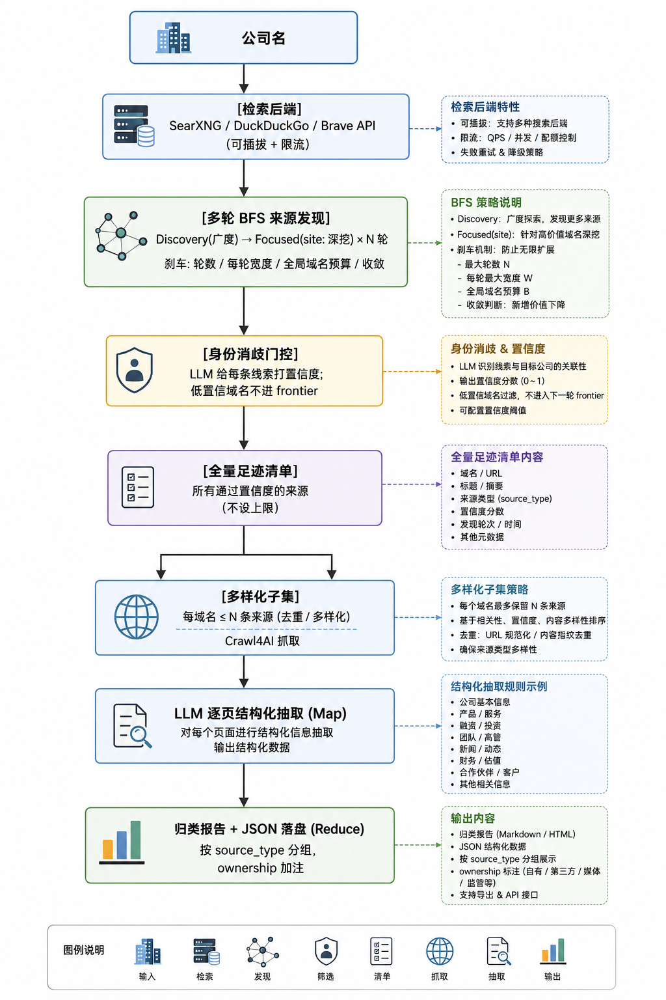

# Vestige

> 追踪一家公司在全网留下的所有踪迹。
>
> Vestige 是一个公司网络足迹情报工具(Company Web Footprint Intelligence):给定一个公司名,自动发现它在全网出现的所有地方——官网、社媒、展会、协会、B2B 平台、新闻、论坛、招聘、公开记录等——并按"来源类型 × 所有权"结构化归类。

---

## 它做什么

输入一个公司名(及可选的身份特征),Vestige 会:

1. **多轮 BFS 来源发现**:用少量高覆盖查询广度发现"哪些来源在提这家公司",再针对发现的域名动态深挖,一轮轮顺藤摸瓜(受深度/预算刹车控制)。
2. **身份消歧**:基于身份锚点(官网域名/行业/地区)判断每条线索"是不是同一家公司",过滤同名 App、游戏、无关个人等噪声。
3. **结构化抽取**:对多样化子集抓取网页,用 LLM 按固定 schema 抽取(来源类型、所有权、联系方式、证据片段)。
4. **输出**:一份完整的足迹清单(控制台报告 + Excel 文件)。

## 架构 / 流水线



## 双维度分类(参考 OSINT)

每个来源按两个正交维度标注:

- **source_type(内容来源性质)**:`owned / social / news_media / community_ugc / marketplace_directory / reference / public_record / recruitment / academic_technical / other / irrelevant`
- **ownership(所有权)**:`first_party`(公司自有) / `third_party`(他人提及) / `unknown`

内部用英文枚举(稳定机器键),报告展示时映射成中文。

## 项目结构

```
.
├── frontend/               # Web 前端（Vite + React）
├── backend/                # 全部 Python 后端
│   ├── main.py             # CLI 入口
│   ├── pipeline.py         # 编排 + 报告 + Excel
│   ├── config.py           # 模型 / 检索 / BFS / 锚点
│   ├── app.py              # FastAPI 应用工厂
│   ├── worker.py           # 消费 queued runs
│   ├── application/        # Web → pipeline 服务层
│   ├── search/             # 找 URL（BFS + 消歧）
│   ├── crawler/            # 抓页面
│   ├── extract/            # HTML 抽字段
│   ├── llm/                # 消歧 + 抽取
│   ├── export/             # Excel 导出
│   └── tests/
├── docker/                 # SearXNG + Camofox
├── searxng/                # SearXNG 配置
├── scripts/                # Cloak 等脚本
├── requirements.txt
└── output/                 # Excel + vestige.db（.gitignore）
```

## 安装

```bash
python3 -m venv venv
source venv/bin/activate
pip install -r requirements.txt

# Crawl4AI 首次使用需要装浏览器内核
crawl4ai-setup

# Cloak 反爬（npm，非 Docker）
cd scripts/cloak && npm install
```

## 一键启动（日常）

首次准备（各做一次）：

```bash
cp .env.example .env          # 填 API keys + CAMOFOX_API_KEY
cd scripts/cloak && npm install # Cloak 反爬（非 Docker）
pip install -r requirements.txt && crawl4ai-setup
```

之后每次开机 / 开新项目：

```bash
make up        # 启动 SearXNG + Camofox + 健康检查
make run       # 运行 pipeline
```

停止 Docker：

```bash
make down
```

查看状态：`make status` · 看日志：`make logs` · 全部命令：`make help`

## Web Admin（可视化控制台）

除了 CLI（`make run`），Vestige 还提供一个 Web 控制台：管理公司、发起发现任务、查看任务与来源清单、对比历史运行。Python 全在 `backend/`，前端在 `frontend/`。

首次准备（前端依赖，做一次）：

```bash
cd frontend && pnpm install
```

之后每次启动，开三个终端：

```bash
make api      # 终端 1：FastAPI 后端，http://127.0.0.1:8001
make worker   # 终端 2：消费 queued 任务并跑 pipeline
make web      # 终端 3：前端，http://localhost:9091
```

浏览器打开 `http://localhost:9091`，默认进入 `/dashboard`（开发模式免登录）。前端通过 Vite 代理把 `/api`、`/dev-api` 转发到后端 `:8001`。

- 数据库：默认 `sqlite:///output/vestige.db`（相对仓库根目录），可用环境变量 `VESTIGE_DATABASE_URL` 覆盖。
- Excel 导出：`output/runs/<run_id>/`（按 run 隔离，避免互相覆盖）。
- CLI 与 Web Admin 共用同一套 pipeline；Web 侧通过 `backend/application/run_company.py` 注入公司锚点，不再依赖改 `config.py`。
- Worker 单进程轮询：`make worker`；一次性消费：`PYTHONPATH=backend python3 -m worker --once`。
- 历史 CLI 结果入库：`make import-output`（读取 `output/*.xlsx` / `output/*.json`，幂等可重复执行）。
- 与 MfgRadar 公司主数据对齐：`make sync-companies`（按官网域名双向同步，不改动 MfgRadar 已有竞品名）。
- B2B 平台/协会渠道库：`make import-b2b`（导入 `b2b_platforms.db` 到 `channels` 表，前端 `/channels` 浏览）。
- ExpoMind 分层同步：`make sync-expomind`（竞品 → Targets；Yes/High 潜客 → Candidates；制造=是且 lead≠No → Candidates；不全量灌展会池）。
- OpenClaw 日常信号直写 Vestige DB（方案 A）：`POST /api/companies/{id}/ingest`；创建公司时自动 scaffold `~/.openclaw/workspace/agents/<slug>/`，已有公司可用 `make scaffold-agents`。
- 触发 OpenClaw 跑公司 agent：`make run-agent DOMAIN=xometry.com`（或 `ID=` / `SLUG=`）；后台：`DETACH=1`；无 gateway 时：`LOCAL=1`。API：`POST /api/companies/{id}/run-agent`。

Companies 分层：`candidate`（候选池）→ Save → `target`（跟踪）→ Start discovery → `monitoring`。

> Compare API 与完整 diff 视图仍待接入；任务执行与来源落库已可由 worker 完成。

## Docker 服务（可选细节）

自建检索 / Camofox 浏览器 API，统一由 `docker/` 编排：

```bash
# 等价于 make up 的核心步骤
make docker-up-crawler
make docker-check
```

| 服务 | 地址 | 用途 |
|------|------|------|
| SearXNG | `http://127.0.0.1:8080` | `SEARCH_BACKEND=searxng` |
| Camofox | `http://127.0.0.1:9377` | crawler 链中间层 |
| Cloak | `scripts/cloak/` (npm) | crawler 链末层，按需子进程启动 |

未部署 Camofox 时可在 `config.py` 设置 `CRAWLER_CHAIN = ["crawl4ai", "cloak"]`。

也可单独启动 SearXNG：`cd searxng && docker compose up -d`（与 `make docker-up` 等价）。

若 SearXNG 已在 `searxng/` 跑过，再 `make docker-up-crawler` 会报容器名冲突；此时只需：

```bash
make docker-camofox   # 只起 Camofox
```

或先停旧栈再统一起：`cd searxng && docker compose down`，然后 `make docker-up-crawler`。

## 配置

### 1. 环境变量 `.env`

按所选模型/后端配置对应的 key,例如:

```bash
# LLM(litellm 透传，按你的服务商填)
DEEPSEEK_API_KEY=sk-xxx
# 若用 Brave 检索后端
BRAVE_API_KEY=xxx
```

### 2. `config.py` 关键项

| 配置 | 说明 |
|---|---|
| `ACTIVE_MODEL` | litellm 模型名,如 `deepseek/deepseek-chat`、`openai/gpt-4o` |
| `SEARCH_BACKEND` | `exa` / `ddg` / `searxng` / `brave`,一行切换检索源 |
| `SEARCH_MAX_CONCURRENCY` / `SEARCH_MIN_INTERVAL_SEC` | 检索限流(避免被上游反爬) |
| `COMPANY_ANCHOR` | 目标公司身份锚点(名称/官网/行业/地区/别名),消歧的基准 |
| `RELEVANCE_THRESHOLD` | 置信度阈值,低于则过滤、且不进 BFS 扩展 |
| `SCORE_LEADS_BATCH_SIZE` | LLM 消歧每批线索数(过大易触发上游 500) |
| `SCORE_LEADS_MAX_RETRIES` / `SCORE_LEADS_RETRY_BACKOFF_SEC` | 消歧 5xx/超时重试 |
| `SCORE_LEADS_BFS_ABORT_UNSCORED_RATIO` | 未评分线索占比超此值则停止 BFS |
| `MAX_BFS_ROUNDS` / `MAX_DOMAINS_PER_ROUND` / `MAX_TOTAL_DOMAINS_TO_EXPAND` | BFS 三道刹车 |
| `MAX_URLS_TO_CRAWL` / `MAX_CRAWL_PER_DOMAIN` | 深度抓取的成本预算(不影响足迹清单完整性) |
| `DISCOVERY_QUERY_TEMPLATES` / `FOCUSED_QUERY_TEMPLATES` | 广度/深挖查询模板 |

### 3.(可选) Docker 服务

见上方 **Docker 服务** 一节；`make docker-up-crawler` 一键启动 SearXNG + Camofox。

## 使用

编辑 `config.py` 里的 `COMPANY_ANCHOR` 填入目标公司,然后:

```bash
make run
```

控制台会打印分组后的足迹报告,同时在 `output/<公司名>.xlsx` 写入结构化结果。

## 输出

### 控制台报告

```
# 公司「Protolabs」全网足迹清单
共发现 N 个可信来源，其中 M 个做了深度抽取。按来源类型(source_type)分组：

## 自有/官方 (4)
- [100% · 第一方(公司自有)] https://www.protolabs.com/
    联系方式: contact@protolabs.com
    证据: ...
## 社媒 (1)
- [100% · 第一方(公司自有)] https://www.linkedin.com/company/proto-labs/
...
```

### Excel (`output/<公司名>.xlsx`)

三个工作表:

| 工作表 | 内容 |
|--------|------|
| **摘要** | 公司信息、生成时间、来源类型/归属统计 |
| **足迹清单** | 全部可信来源(URL 可点击)，含深度抽取的联系方式与证据 |
| **平台聚合** | 名录/B2B 类来源按平台汇总 |

> **足迹清单**包含全部通过置信度的来源;未做深度抽取的行，深度相关列为空。

## 检索后端说明

| 后端 | 特点 | 适用 |
|---|---|---|
| `exa` | Exa 神经搜索 API,稳定、支持 `include_domains` | **推荐**,替代 DDG/SearXNG |
| `ddg` | DuckDuckGo(`ddgs` 库),免费免 key | 原型/备用 |
| `searxng` | 自建元搜索,聚合多引擎 | 低并发可用；高并行易 CAPTCHA |
| `brave` | Brave Search API,稳定 | 上量 / 生产 |

**限流提醒**: SearXNG 每次查询会扇出到大量上游。住宅 IP 建议 ≤2–3 并发、约 ≤10 次/分钟（`SEARXNG_MAX_CONCURRENCY` / `SEARXNG_MIN_INTERVAL_SEC`）。`engines=` 缩小引擎集是 VPS/已烧 IP 的权衡，不是默认。仍更推荐 `exa`（`.env` 配 `EXA_API_KEY`）或带 key 的 `brave`。
若启用实例侧保护，在 `searxng/core-config/settings.yml` 的 `server:` 下加 `limiter: true` 后重启容器。
`site:` 查询在 Exa 后端会自动转为 `include_domains`。

## 注意事项

- 这是一个研究/自用性质的情报聚合工具,请遵守各平台 ToS 与当地数据合规要求。
- LinkedIn/Facebook 等平台对爬虫敏感,直接抓取常拿不到完整内容,通常只能依赖搜索摘要。
- LLM 消歧失败时线索保持 `confidence=None`,不会默认 0.5 放行 BFS;请检查 `ACTIVE_MODEL` 与 API 可用性,或调小 `SCORE_LEADS_BATCH_SIZE`。

## 技术栈

Python · asyncio · [Crawl4AI](https://github.com/unclecode/crawl4ai) · [LiteLLM](https://github.com/BerriAI/litellm) · [ddgs](https://github.com/deedy5/duckduckgo_search) · [SearXNG](https://github.com/searxng/searxng) · httpx
